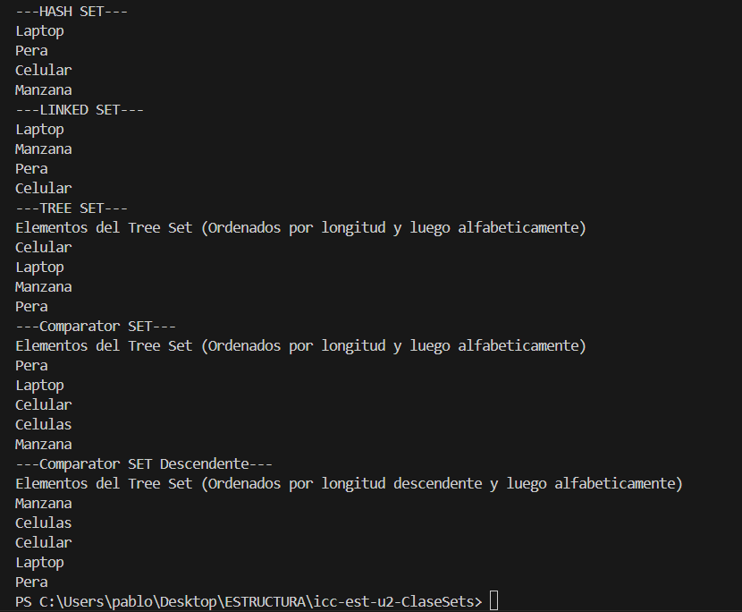
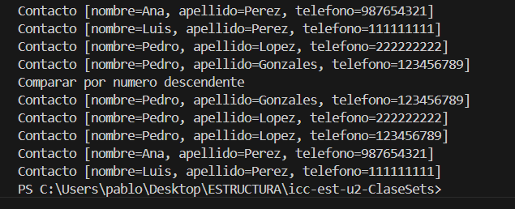

# Práctica de Implementación de Set en Java

## 📌 Información General

- **Título:** Práctica de Implementacion de Set Java
- **Asignatura:** Estructura de Datos
- **Carrera:** Computación
- **Estudiante:** Pablo Feijo
- **Fecha:** 7/1/2025
- **Profesor:** Ing. Pablo Torres

---

## 🛠️ Descripción

Este proyecto demuestra el uso de diferentes implementaciones de la interfaz `Set` en Java para almacenar y ordenar colecciones sin elementos duplicados. Las clases utilizadas incluyen:

- `HashSet`: Almacena los elementos sin un orden específico.
- `LinkedHashSet`: Mantiene el orden de inserción de los elementos.
- `TreeSet`: Ordena automáticamente los elementos de forma natural o usando un `Comparator` personalizado.

Además, se han implementado comparadores personalizados para ordenar cadenas por:
- Longitud ascendente y, en caso de empate, orden alfabético.
- Longitud descendente y, en caso de empate, orden alfabético inverso.

---

## 🚀 Ejecución

Para compilar y ejecutar el proyecto:

